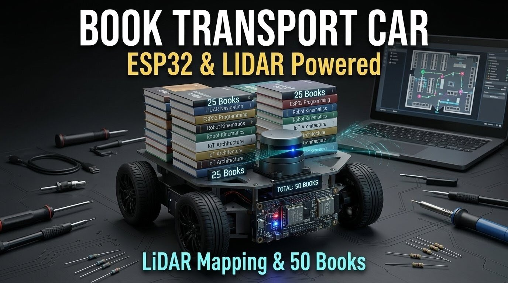

# 📚 Book Transport Buggy 📚

An autonomous robot designed to transport classroom books through school corridors using LiDAR navigation and mobile app control. The system reduces the effort required by teachers to carry large stacks of books and enables automatic delivery to classrooms.

## Overview

Teachers often need to carry 40–50 books along with personal items such as bottles, diaries, and bags. This process consumes time and often requires students to assist in transporting books between classrooms.

The Book Transport Buggy solves this problem by acting as an autonomous delivery robot. The robot maps the school corridor and can be summoned to a specific classroom using a mobile application built with MIT App Inventor. Once triggered, the buggy navigates the corridor and stops in front of the selected classroom before the teacher arrives.

## Features

Autonomous corridor navigation using LiDAR  
ESP32 based control system  
Live visual monitoring using ESP32-CAM  
Mobile app control using MIT App Inventor  
Capable of carrying up to 50 books  
Motor driven platform using N20 metal gear motors  
L298N motor driver for motor control  
Pre-mapped corridor navigation  
Classroom selection through mobile app  

## Components Used

ESP32 Microcontroller  
ESP32-CAM Module  
LiDAR Sensor  
L298N Motor Driver  
N20 Metal Gear Motors  
Robot Chassis  
Rechargeable Battery Pack  
WiFi Communication  
MIT App Inventor Mobile Application  

  

 

## Working Principle

1. The school corridor is mapped using LiDAR data.
2. The robot stores navigation paths for different classrooms.
3. A teacher opens the mobile application built using MIT App Inventor.
4. The teacher selects the desired classroom from the app.
5. The robot receives the command through WiFi.
6. The buggy autonomously navigates through the corridor.
7. The robot stops in front of the selected classroom door.
8. The teacher arrives and collects the books.

## Applications

School automation systems  
Educational robotics projects  
Autonomous delivery robots  
Smart campus solutions  

## Future Improvements

Obstacle detection and avoidance  
Autonomous return to charging station  
Automatic classroom detection using vision  
Real time robot tracking system  
Battery level monitoring  

## Author

Embedded Systems Project by Jash.
